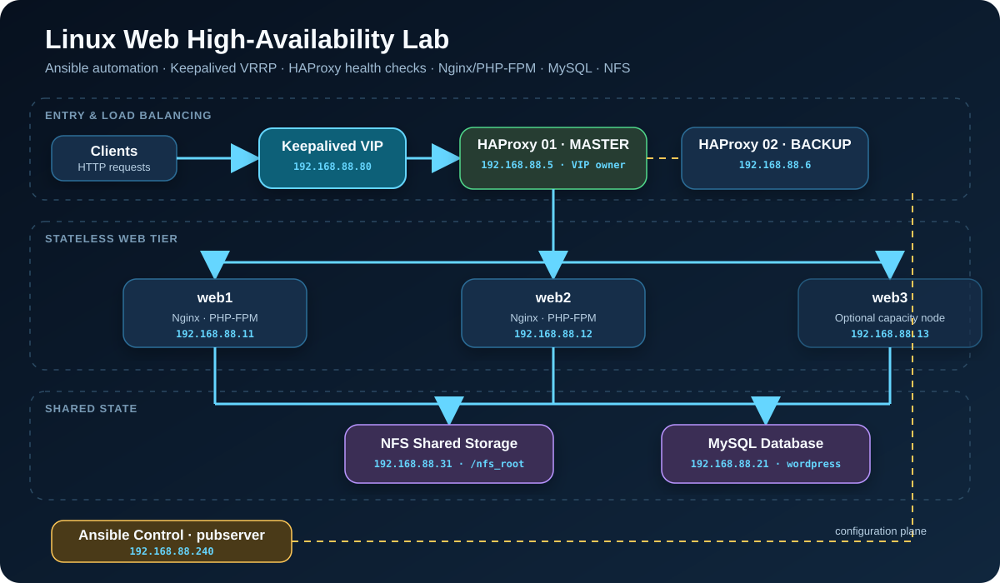
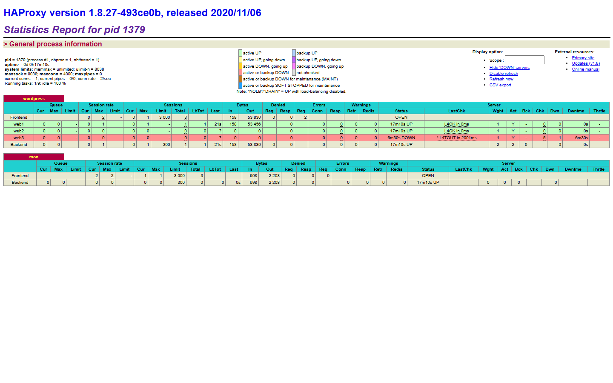

# Linux High-Availability Web Architecture Lab

[](https://github.com/z2596160623-cloud/linux-ha-web-architecture/actions/workflows/validate.yml)

[中文](README.md) · [Deployment](docs/deployment.md) · [Operations](docs/operations.md) · [Incident Review](docs/troubleshooting.md)

This is a multi-node Rocky Linux web infrastructure lab that I designed, implemented, and verified independently. WordPress is used as the workload, while Ansible provisions the web tier, database, shared storage, load balancers, and a highly available virtual IP.

> Scope: a personal cloud computing and Linux operations portfolio project. It reproduces important production architecture patterns, but it is not presented as a drop-in production platform.



## Highlights

- **Eight-node topology:** one Ansible controller, two HAProxy/Keepalived nodes, three Nginx/PHP-FPM nodes, one MySQL node, and one NFS node.
- **Two levels of availability:** Keepalived moves the `192.168.88.80` VIP, while HAProxy applies round-robin scheduling and active backend health checks.
- **Separated state:** MySQL runs on its own node and WordPress files are shared through NFS across the web tier.
- **Automated delivery:** the original 14 staged playbooks were refactored into reusable Ansible roles with Vault-backed secrets.
- **Real troubleshooting loop:** an NFS mount was missing after boot, causing HTTP 403 responses. Reapplying the mount play restored HTTP 200 on both backends and the VIP.
- **Observable behavior:** HAProxy reported the two online backends as `UP / L4OK` and the intentionally powered-off third backend as `DOWN`.

## Verified State

The stack was verified on **2026-07-19**. To stay within a 16 GB host memory budget, `web3` was intentionally powered off while `web1` and `web2` served traffic.

| Check | Result |
| --- | --- |
| Keepalived VIP | `192.168.88.80` owned by `haproxy01` |
| HAProxy / Keepalived | active on both load-balancer nodes |
| Web backends | `web1` and `web2` reported `UP / L4OK` |
| Offline-node detection | `web3` reported `DOWN / L4 timeout` |
| HTTP consistency | both backends and the VIP returned `200` with identical hashes |
| Database | MySQL active, WordPress database present, port 3306 listening |
| Shared storage | NFS/RPC active with `/nfs_root` exported |




See [docs/evidence.md](docs/evidence.md) for the evidence and validation boundaries.

## Technology

Rocky Linux 8.6 · Ansible Core 2.13.3 · HAProxy · Keepalived/VRRP · Nginx · PHP-FPM · WordPress · MySQL · NFS · systemd · curl

## Quick Start

```bash
cd ansible
cp inventory.example.ini inventory.ini
cp vault.example.yml vault.yml
# Edit vault.yml, then encrypt it before use.
ansible-vault encrypt vault.yml
ansible-galaxy collection install -r collections/requirements.yml
ansible-playbook -i inventory.ini site.yml -e @vault.yml --ask-vault-pass
```

Run the read-only smoke test:

```bash
VIP_URL=http://192.168.88.80 \
WEB_URLS="http://192.168.88.11 http://192.168.88.12" \
./scripts/smoke-test.sh
```

## Work Completed

- Designed the node and service topology.
- Automated Nginx, PHP-FPM, MySQL, NFS, HAProxy, and Keepalived configuration.
- Separated WordPress database and file state from the web tier.
- Implemented backend scheduling, health checks, statistics, VRRP priorities, and a floating VIP.
- Verified services, ports, content consistency, and unhealthy-node removal.
- Diagnosed and restored an NFS mount that caused HTTP 403 responses.
- Refactored the lab into a public, secret-free, reproducible repository.

## License

Original code and documentation are licensed under the [MIT License](LICENSE). Screenshots are included only as evidence of this lab's runtime state.
